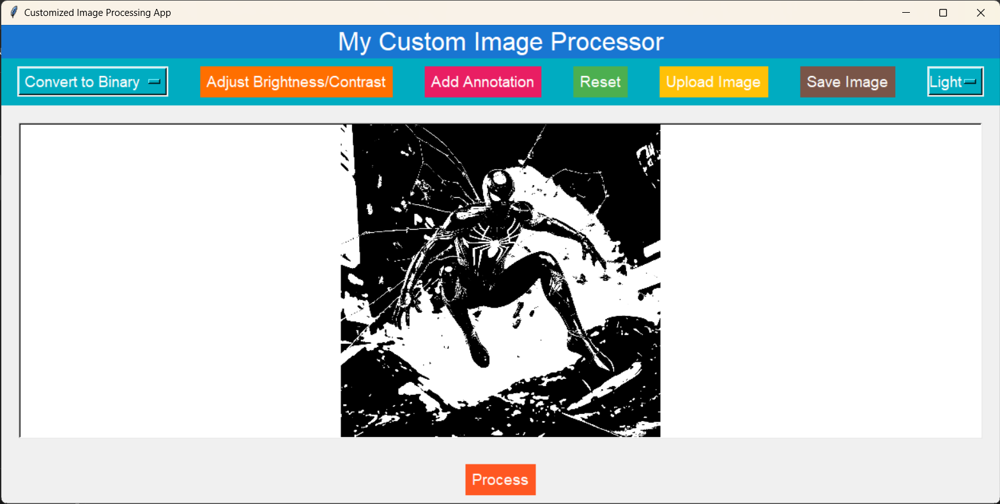

# CIPWizard-(Custom-Image-Processor-Wizard)
### Customized Image Processing App

This is a customized image processing application built using Python and Tkinter. The application allows users to perform various operations on images such as converting to different color spaces, adjusting brightness/contrast, applying edge detection, and more.

## Features

- **Upload Image**: Users can upload an image from their local system.
- **Process Image**: Users can select from a variety of image processing operations such as converting to RGB, grayscale, binary, adjusting brightness/contrast, applying edge detection, and more.
- **Save Image**: Processed images can be saved back to the local system.
- **Add Annotation**: Users can add text, rectangles, circles, and lines to the image as annotations.
- **Reset**: Allows users to revert back to the original image.
- **Change Theme**: Provides options to switch between light and dark themes for better user experience.

## Instructions

1. **Upload Image**: Click on the "Upload Image" button to select an image from your local system.
2. **Select Operation**: Choose an image processing operation from the dropdown menu.
3. **Process**: Click on the "Process" button to apply the selected operation to the image.
4. **Save Image**: Once satisfied with the processed image, click on the "Save Image" button to save it locally.
5. **Add Annotation**: Use the "Add Annotation" button to add text, shapes, or lines to the image.
6. **Reset**: To revert back to the original image, click on the "Reset" button.
7. **Change Theme**: Switch between light and dark themes using the dropdown menu in the navbar.

## How to Run

To run the application, follow these steps:

1. Ensure you have Python installed on your system.
2. Clone this repository to your local machine.
3. Navigate to the project directory in your terminal.
4. Install the required dependencies using `pip install -r requirements.txt`.
5. Run the application by executing `python image_processing_app.py` in your terminal.

## Dependencies

- Python 3.x
- OpenCV (cv2)
- NumPy
- Tkinter (included in Python standard library)
- PIL (Python Imaging Library)
- scikit-image (for edge detection)

## Screenshots

## Contributing

Contributions are welcome! If you have any suggestions or find any issues, feel free to open an issue or create a pull request.
